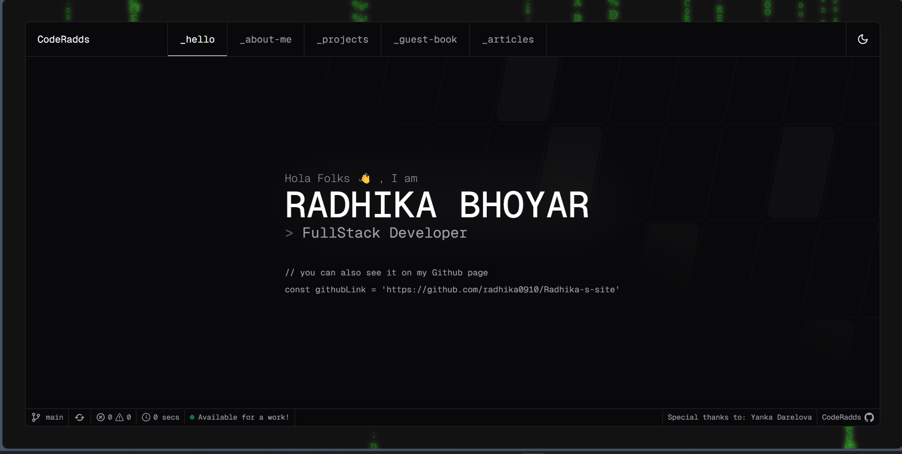
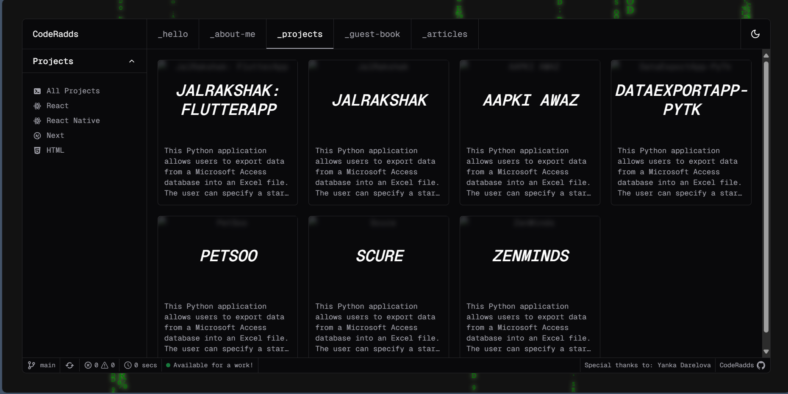
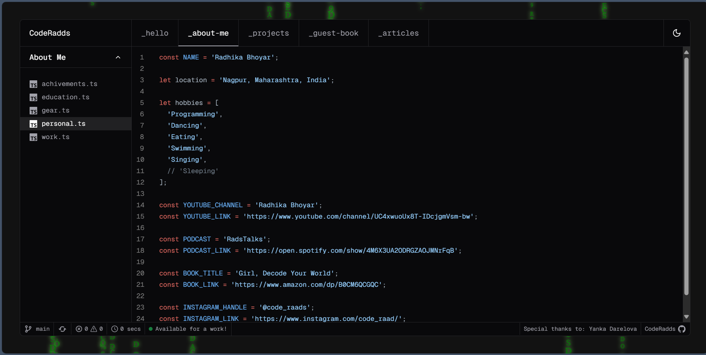

# Radhika's Portfolio

## Overview

Welcome to my personal portfolio! This project showcases my skills, projects, and experience as a web developer. With a sleek design and intuitive user interface, this portfolio serves as a digital representation of my work and accomplishments.

## Preview





## Features

- Responsive design for optimal viewing on all devices
- Interactive components and smooth animations
- Sections for projects, about me, skills, experience, and contact information
- Customizable themes and color schemes
- Seamless navigation with Next.js routing

## Technologies Used

- [Next.js 14 (App Router)](https://nextjs.org) - React framework for building full-stack web applications
- [TailwindCSS](https://tailwindcss.com) - Utility-first CSS framework for rapid styling
- [Shadcn UI](https://ui.shadcn.com/) - Beautifully designed components built with Radix UI and Tailwind CSS.
- [Next Auth](https://next-auth.js.org) - Complete open-source authentication solution for Next.js applications.

## Getting Started

### Prerequisites

- Node.js v18.17+
- npm or yarn package manager

### Installation

```bash
git clone https://github.com/radhika0910/Radhika-s-site.git
cd Radhika-s-site
npm install
npm run dev
```

#### Create a .env file similar to .env.example.

## Customization

This portfolio is designed to be easily customizable. You can modify the themes, colors, and content to suit your preferences. Simply edit the relevant files in the project and customize according to your needs.

## Deployment

You can deploy this portfolio project on platforms like Vercel, Netlify, or GitHub Pages. Follow the deployment instructions provided by your chosen platform to get your portfolio live on the web.

## Contributing

Contributions to this project are welcome! If you have any suggestions, bug fixes, or feature requests, feel free to open an issue or submit a pull request following our contributing guidelines.

## Credits

Thanks to the creators of Next.js, TailwindCSS, Shadcn UI, and Next Auth for providing the tools and libraries used in this project. Inspiration and design ideas from various portfolio templates and examples found online.

## License

This project is licensed under the MIT License. You are free to use, modify, and distribute this code for personal and commercial purposes. Attribution is appreciated but not required.

## Live Demo

Check out the live demo of this portfolio [here](https://radhika-s-site.vercel.app/) .
